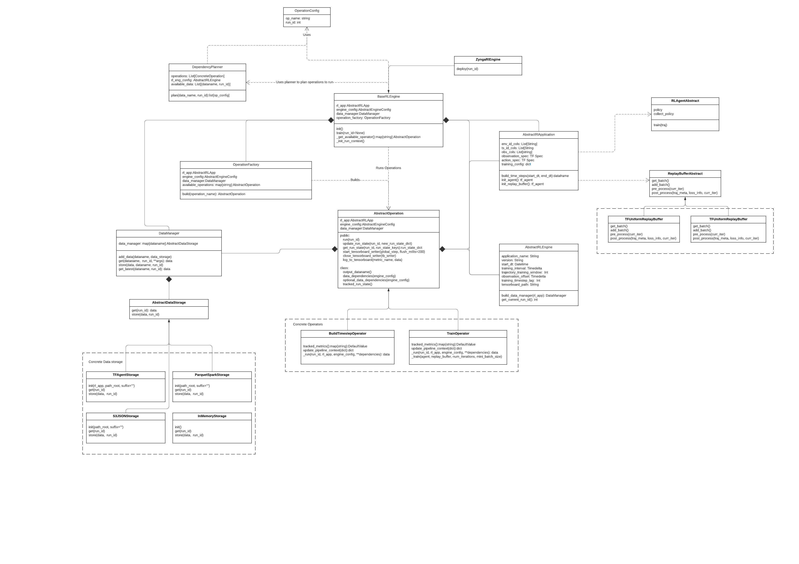

# RL Bakery (alpha)
Note: The interfaces and general use cases are stable for this library, but we're currently working on better documentation and examples.

## Overview
This library makes it easy to build production batch Deep Reinforcement Learning and Contextual Bandits applications. We use this at [Zynga](http://www.zynga.com) to personalize our games, eg. picking the best time of day to send messages, selecting daily challenges and personalizing the next level for games. The Deep RL applications created by this library are run in production for millions of users per day.

## Usage
New applications are created by inheriting from an RLApplication class and implementing a few functions. For example, specifying the Agent algorithm to use and how to get data for a specific time period. RL Bakery can then execute the application to construct (State, Action, Reward, Next State) trajectories to train an RL Agent. A trained Agent is basically a deep learning model, which can  be served in real time or used to generate batch values for a population of environments.

See [rl_bakery/example/cartpole.py](rl_bakery/example/cartpole.py) for an example with the OpenAI cartpole environment. While that example uses an [OpenAI Gym](https://gym.openai.com/) environment, typical applications for RL Bakery will get state from a warehouse.

## Authors
Patrick Halina, Mehdi Ben Ayed, Peng Zhong,

## Implementation Overview
RL Bakery utilizes [Apache Spark]( https://spark.apache.org/) to gather and transform data into trajectories of (State, Action, Reward, Next State). RL Bakery does not implement any RL Algorithms like PPO, TD3, DQN, A3C etc. Instead, we wrap the [TF-Agents]( https://github.com/tensorflow/agents) library.

Class diagram:


 
## Setup

### Github
This library is meant to be run on a Spark cluster. If you're testing this locally, you can simply use the PySpark library.
This assumes you have Python 3.6+ installed.
1. Clone repo, cd to root dir
1. Create a virtual env: `python3 -m venv venv`
1. `source venv/bin/activate`
1. Install packages: `pip3 install -r requirements.txt`

To run this on a Mac, you must install java to run locally with pyspark.  https://www.java.com/en/download/mac_download.jsp
Add 'export JAVA_HOME=/Library/Internet\ Plug-Ins/JavaAppletPlugin.plugin/Contents/Home' to your .bash_profile

### PyPI
This is coming soon!

## Tests
Unit tests with this command

```python -m unittest discover rl_bakery -p 'test_*.py'```

## Building
To build a wheel run this command:

```python setup.py bdist_wheel```

A wheel distribution will then be available in dist directory
